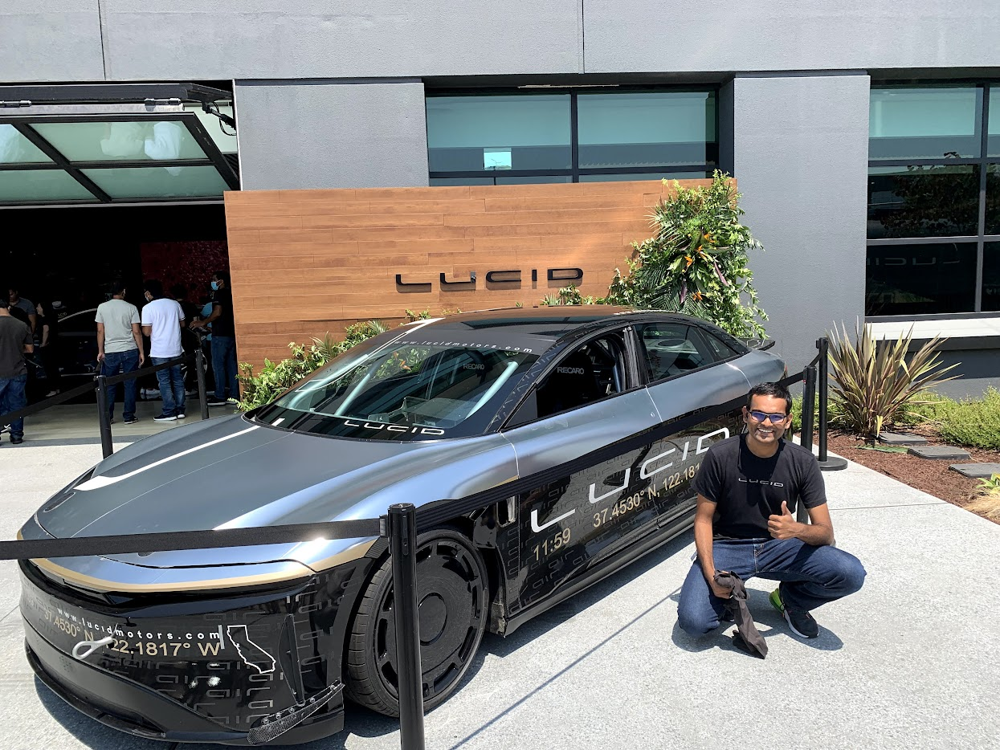

### My story

I am currently a Behavior Planning Engineer at Lucid Motors, developing vehicle behaviors for Highway Assist Functionalities. My day to day work involves finding gaps and measuring costs! 

I graduated from Stanford with a Master of Science in Mechanical Engineering(Planning and Controls) and graduated Summa Cum Laude from Ahmedabad University with a Bachelor of Technology in Mechanical Engineering. My research focus in undergraduate studies had been in implementation of nonlinear control for multi-body robotics under the guidance of Prof. Harshal Oza.

Apart from my professional and academic pursuits, I spend my time working on home automation DIY projects and disassembling old pieces of hardware and trying to to put them back together(often unsuccessfully)! 